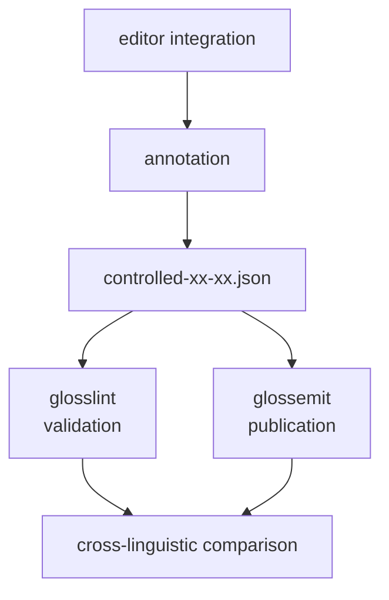

# glosslint / glossemit


`glosslint` and `glossemit` are small UNIX-style tools for working with interlinear gloss annotation.

- **glosslint** checks annotation consistency.
- **glossemit** emits publication-ready LaTeX or HTML fragments.
- **controlled-xx-xx.json** is the shared, machine-readable annotation specification used by both.

Together they form a small glosssuite workflow in which annotation conventions are not merely documented: they are exercised through validation and publication.

## Purpose

The project is designed to make gloss annotation reusable rather than disposable.

Annotation data, annotation specifications, validation, editor integration, and publication output are kept separate but composable. A project can preserve its own corpus structure, use `jq` to select or transform the needed records, validate them with `glosslint`, and publish them with `glossemit`.

The shared controlled specification can also become a basis for cross-linguistic comparison of the distinctions that different annotation systems actually operationalize.

## Architecture



The central file is not merely a vocabulary list. It records annotation fields, controlled grammatical inventories, and emission defaults. Because it participates in actual annotation, validation, and publication, it functions as an **operational annotation specification**.

See [`docs/controlled.md`](docs/controlled.md) for the specification and its role as a shared resource for cross-linguistic comparison.

## Design

The tools follow the UNIX philosophy: small programs, explicit stream interfaces, and composition through pipes.

For validation:

```text
corpus JSON
    ↓ jq
TSV annotation stream
    ↓
glosslint + controlled-xx-xx.json
    ↓
source-aware diagnostics
```

For publication:

```text
corpus JSON / SUI output / other JSON
              ↓ jq
             JSONL
              ↓
          glossemit
           /     \
        LaTeX    HTML
```

`glossemit` is not a mandatory postprocessor of `glosslint`; the two are sibling tools that share the same specification. A corpus is not required to adopt one prescribed JSON organization. It only needs to produce the stream required by the selected tool.

## controlled-xx-xx.json

A controlled file can contain:

```json
{
  "schema": { ... },
  "conjugation": { ... },
  "pos": { ... },
  "gloss": { ... },
  "emit": {
    "latex": { ... },
    "html": { ... }
  }
}
```

A working Japanese-English example is provided at:

```text
config/controlled-ja-en.json
```

The file is shared by validation and emission. It can also serve as a comparable record of which grammatical and annotation distinctions are made explicit in a language-specific workflow.

For the complete format, see [`docs/controlled.md`](docs/controlled.md).

## Build

Requirements:

- a C compiler such as `gcc`
- `make`
- `jq`
- Jansson (for `glossemit`)
- UTF-8 input

Build both programs with:

```sh
cd src
make
```

Install with:

```sh
sudo make install
```

## Documentation

- [`docs/glosslint.md`](docs/glosslint.md) — validation and diagnostics
- [`docs/glossemit.md`](docs/glossemit.md) — LaTeX / HTML publication
- [`docs/controlled.md`](docs/controlled.md) — shared annotation specification and cross-linguistic comparison
- [`docs/editors/`](docs/editors/) — editor integration

Examples are available under [`examples/`](examples/).

## Principle

The project keeps several responsibilities deliberately separate:

```text
store richly
    ↓
select dynamically
    ↓
validate explicitly
    ↓
publish flexibly
```

The software can report whether annotation conforms to the declared specification. Linguistic interpretation remains a human decision.

## License

MIT License.

## Author

Hilofumi Yamamoto, Ph.D.  
Institute of Science Tokyo
